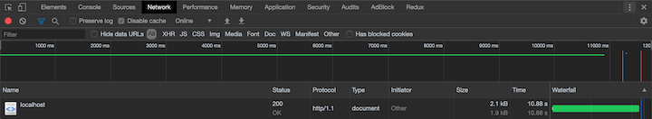

# Node.js Cluster

Learn how to manage cluster by using ['cluster'](https://nodejs.org/api/cluster.html) module from node standard library and npm module ['pm2'](https://www.npmjs.com/package/pm2).

## Source Code

```javascript
// Limit 'crypto.pbkdf2' to use only single thread.
process.env.UV_THREADPOOL_SIZE = 1

const cluster = require('cluster')
const crypto = require('crypto')
const express = require('express')
const app = express()

if (cluster.isMaster) {
  // Single child process.
  cluster.fork()
} else {
  app.get('/', (req, res) => {
    crypto.pbkdf2(
      'secret',
      'salt',
      1000000,
      512,
      'sha512',
      (err, derivedKey) => {
        res.json({ key: derivedKey })
      },
    )
  })

  app.listen(3000, () => {
    console.log('http://localhost:3000')
  })
}
```

---

Generate workload by using [`crypto.pbkdf2`](https://nodejs.org/api/crypto.html#crypto_crypto_pbkdf2_password_salt_iterations_keylen_digest_callback) and ['limit threadpool size'](https://nodejs.org/api/cli.html#cli_uv_threadpool_size_size) to 1. Then create two request at almost same time and this is result.

- First Request


- Second Request


The second request (~20 second) have to wait until the first request (~10 second) finished.

If we fork two children by adding one more line of code `cluster.fork()`. The two requests will finish at almost same time.

- First Request



- Second Request


More simpler way we can use npm module call 'pm2' to create two process by get rid of if statement above and use command `pm2 start app.js -i 2`. The result should be same with two `cluster.fork()`.

## Source Code

```javascript
process.env.UV_THREADPOOL_SIZE = 1

const crypto = require('crypto')
const express = require('express')
const app = express()

app.get('/', (req, res) => {
  crypto.pbkdf2('secret', 'salt', 1000000, 512, 'sha512', (err, derivedKey) => {
    res.json({ key: derivedKey })
  })
})

app.listen(3000, () => {
  console.log('http://localhost:3000')
})
```
